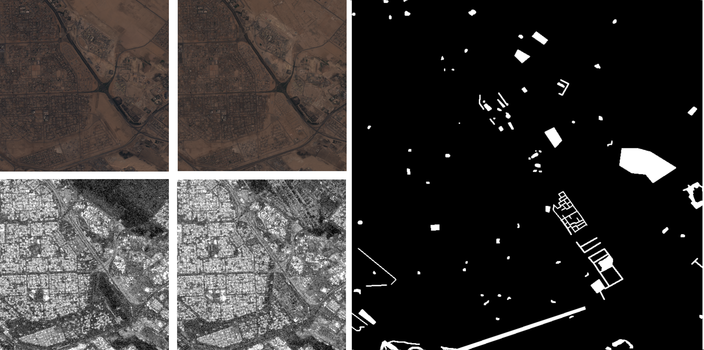

# Fusing Multi-modal Data for Supervised Change Detection


>
> _Exemplary observations utilized in our multi-modal bi-temporal change detection work. Left: Rows of optical Sentinel-2 data as well as co-registered radar Sentinel-1 data. Each column denotes a different time point, pre- and post change. Right: The associated change map. The Sentinel-2 observations and pixel-wise annotations are by Daudt et al (2018), we curated and provide additional Sentinel-1 SAR data._
----
This repository presents the multi-modal change detection SAR Sentinel-1 data (available [here](https://mediatum.ub.tum.de/1619966), paper [here](https://www.int-arch-photogramm-remote-sens-spatial-inf-sci.net/XLIII-B3-2021/243/2021/isprs-archives-XLIII-B3-2021-243-2021.pdf)) utilized in the work of 
> Ebel, Patrick und Saha, Sudipan und Zhu, Xiao Xiang (2021) Fusing Multi-modal Data for Supervised Change Detection. ISPRS. XXIV ISPRS Congress 2021, 04 - 10 July 2021, Nice, France / Virtual.  paper [here](https://www.int-arch-photogramm-remote-sens-spatial-inf-sci.net/XLIII-B3-2021/243/2021/isprs-archives-XLIII-B3-2021-243-2021.pdf)

Please also consider the work of
> Daudt, R. C., Le Saux, B., & Boulch, A. (2018, October). Fully convolutional siamese networks for change detection. In 2018 25th IEEE International Conference on Image Processing (ICIP) (pp. 4063-4067). IEEE.

whose original data set we built upon and extended. The original Sentinel-2 observations and pixel-wise annotations are available [here](https://ieee-dataport.org/open-access/oscd-onera-satellite-change-detection). We curated and provide additional Sentinel-1 SAR measurements, co-registered and temporally aligned with the original data in order to provide an opportunity for multi-sensor change detection. You can find the complementary Sentinel-1 SAR data [here](https://mediatum.ub.tum.de/1619966).

### Updates: 

1. You may also be interested in our follow-up publication 
> S. Saha, P. Ebel and X. X. Zhu, "Self-Supervised Multisensor Change Detection," in IEEE Transactions on Geoscience and Remote Sensing, doi: 10.1109/TGRS.2021.3109957.

  which builds on this data set, released with our ISPRS Congress publication.

2. Provided code under ``` \code```. Credits: The code builds on Rodrigo's [repository](https://github.com/rcdaudt/fully_convolutional_change_detection) and extends it.
